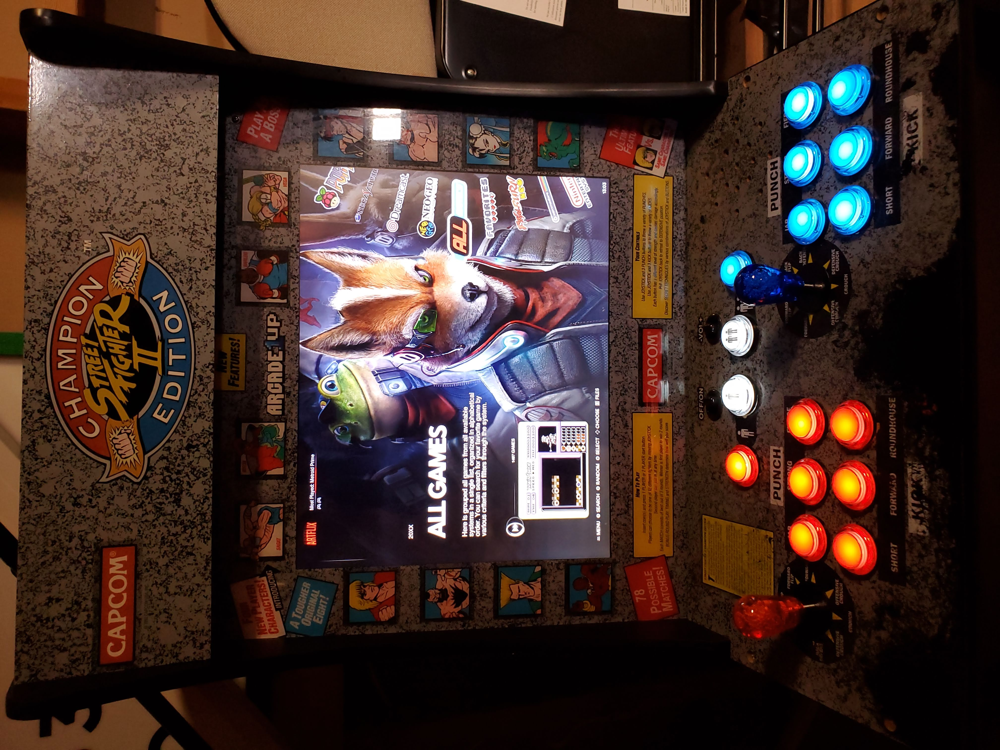
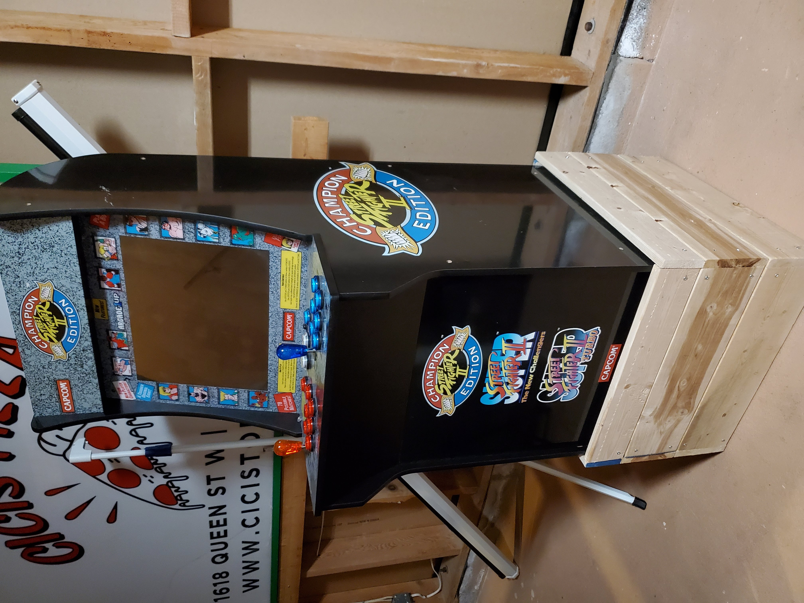

Recently got a used 3/4 scale arcade cabinet with a single game board running Street Fighter 2. Admittedly awesome, it could do more!
So, I ripped the guts out (leaveing just the screen behind). Replaced all the buttons/joysticks with better ones that light up, and shoved an old Dell mini PC into the cabinet. Flashed Batocerta, and Bobs' your uncle.

Due to the smaller size, a chair was needed to comfortablely play. But that's not how you play arcade machines dangit!
So then I built a riser to bring it up 12" off the ground.

