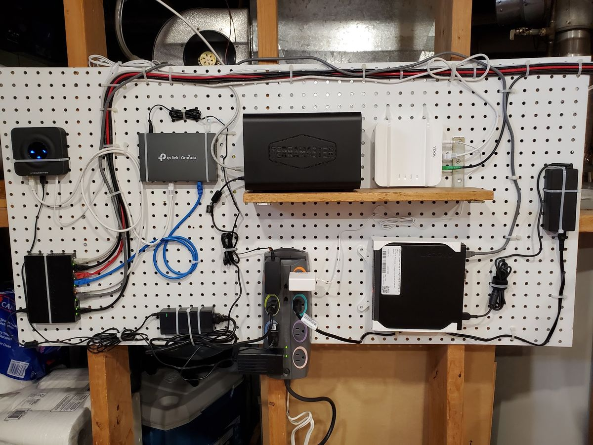

What started as a 2-in-1 WiFi router eventually evolved into a collection of networking devices that all seemed to terminate in one place; so why not organize them onto some pegboard!

Top row, left to right:

- **VoIP ATA** - my wife thought it'd be retro-cool to have a landline. Tapped into a pre-existing RJ11 line up to the living room. Pennies a month for internet phone? Yes please.
- **Omada Router** - the nervous system. It's a router. It.. uh... routes.
- **NAS** - with a few TBs of totally legally acquired content...
- **Fibre Modem** - 500MB/s up and down

Bottom row, left to right:
- **PoE Switch** - Feeding hardlined bits and bots throughout the house. PoE being used for WAP (wireless access point) in the center of the house, and for powering a Zigbee coordinator for various smart switches etc.
- **Power** - the next addition here will be a UPS to avoid downtime when the power flickers.
- **Lenovo ThinkCentre Mini** - the brain; complete with custom 3D printed mount. Came with Windows pre-installed; that lasted about 30 seconds. Debian running Docker is happliy chugging away running Plex, Radarr/Sonarr/Sabnzbd, and a few other fun containers. Most recently (and the most fun) running Home Assistant, giving me quick access to lighting controls, thermostat controls/info, security camera feeds, 3d printer info and more (coming soon)!
