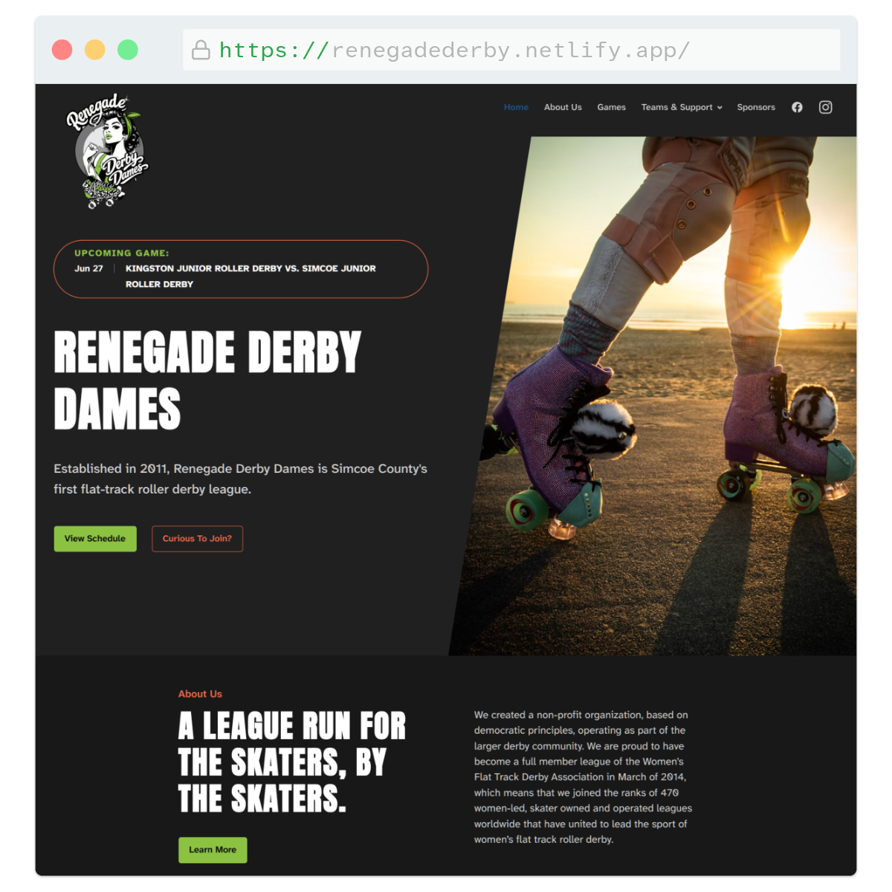
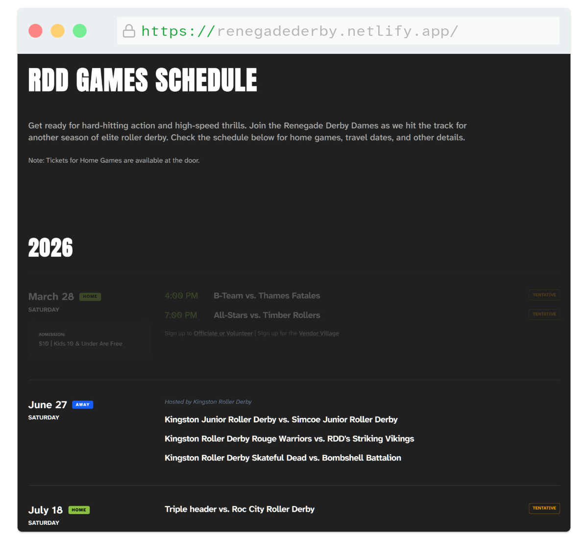
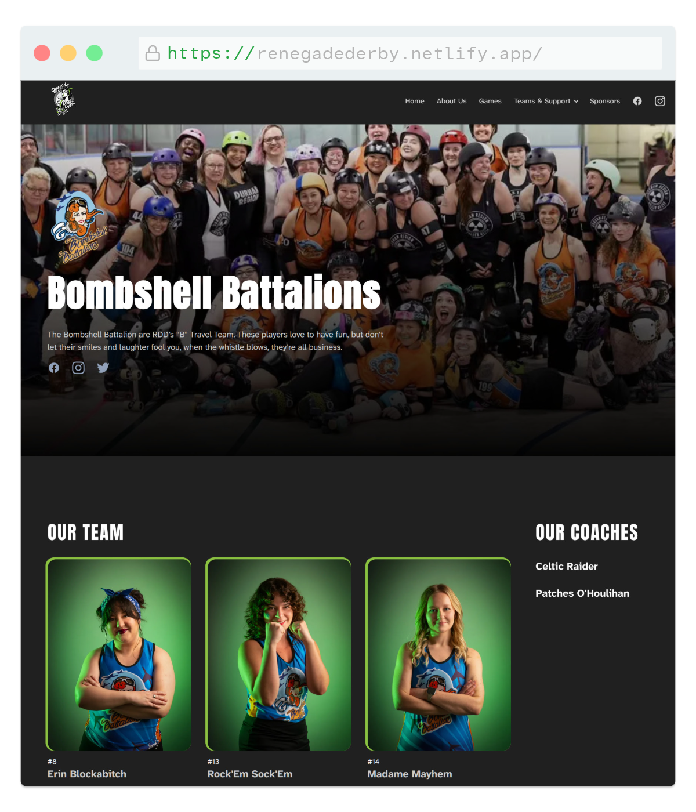

## Project Overview
The Renegade Derby Dames are a local, community-driven roller derby league that needed a bold digital presence to match their energy on the track. The goal was to build a fast, modern web experience to showcase team players, keep fans up to date on game schedules, and streamline the content updates that keep a sports league running smoothly.

- <b>My Role</b>: UI/UX Design, Front-End Development, CMS Integration
- <b>The Stack</b>: Astro, Tailwind CSS, Headless CMS

### The Challenge
Sports leagues run on dynamic data—rosters change, game dates shift, and scores need updating. The client needed a platform that could handle these frequent updates without requiring a developer every time a match was scheduled. The main challenge was delivering an incredibly fast, media-heavy site that captured the gritty, high-energy aesthetic of roller derby, while providing an effortlessly simple editing workflow for non-technical team volunteers.

### The Approach & UX Solution
I designed a vibrant, punchy user interface that focuses heavily on player identity and game-day anticipation, backed by a tailored content management strategy.

- <b>High-Impact Team Aesthetics:</b> Leveraging the league's bold green and black color palette, I designed a layout with sharp typography, clean grids, and prominent player photography to give the team a professional, intimidating, yet highly approachable digital home.
- <b>Fan-Centric Information Architecture:</b> I structured the home page to surface the most critical details first: upcoming bouts, ticketing information, and a look at the active skater roster. 
- <b>Simplified Volunteer Workflow:</b> To solve the maintenance problem, I configured a custom headless CMS solution. I mapped out clean collection schemas tailored specifically to the league's structure, allowing anyone on the committee to update game details or player bios in seconds.

### Technical Execution
To bridge the gap between static performance and dynamic content editing, I moved away from traditional heavy CMS setups and chose a modern component-driven architecture.

- <b>Component-Driven Performance with Astro:</b> Built the site using **Astro**, allowing me to leverage a component-driven workflow that compiles down to zero-JavaScript HTML by default. This keeps the media-heavy skater profiles and match galleries loading instantly.
- <b>Utility-First Styling with Tailwind:</b> Used **Tailwind CSS** to handle the layout and responsive styling. This made it incredibly easy to rapidly prototype the aggressive, modern design lines and maintain a consistent layout system across both small mobile screens and large desktop displays.
- <b>Git-Backed Content Management:</b> Connected the site to a tailored markdown-based CMS. When volunteers modify the schedule or roster through the visual editor, it directly updates the repository data, triggering an automated static rebuild and ensuring the live site stays lightning fast with zero database overhead.
