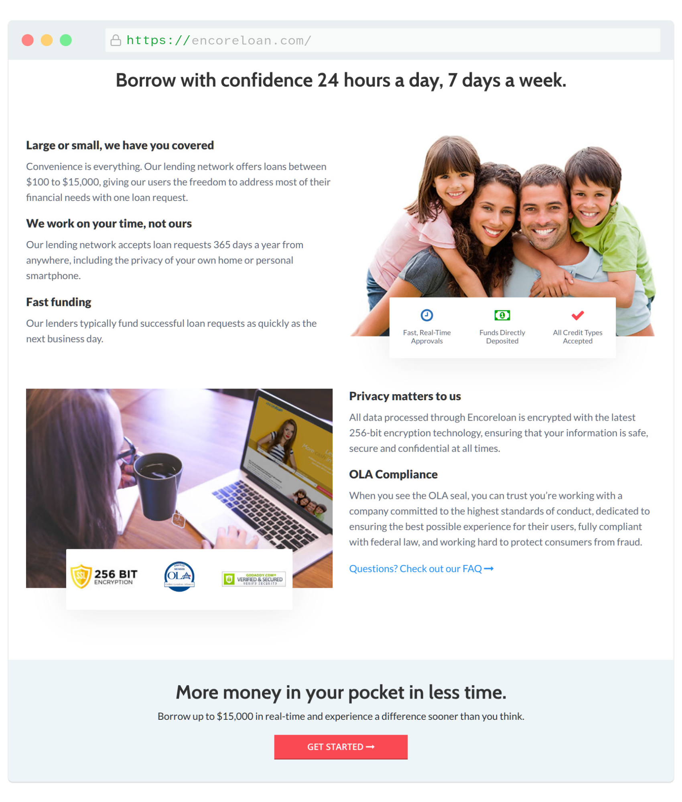
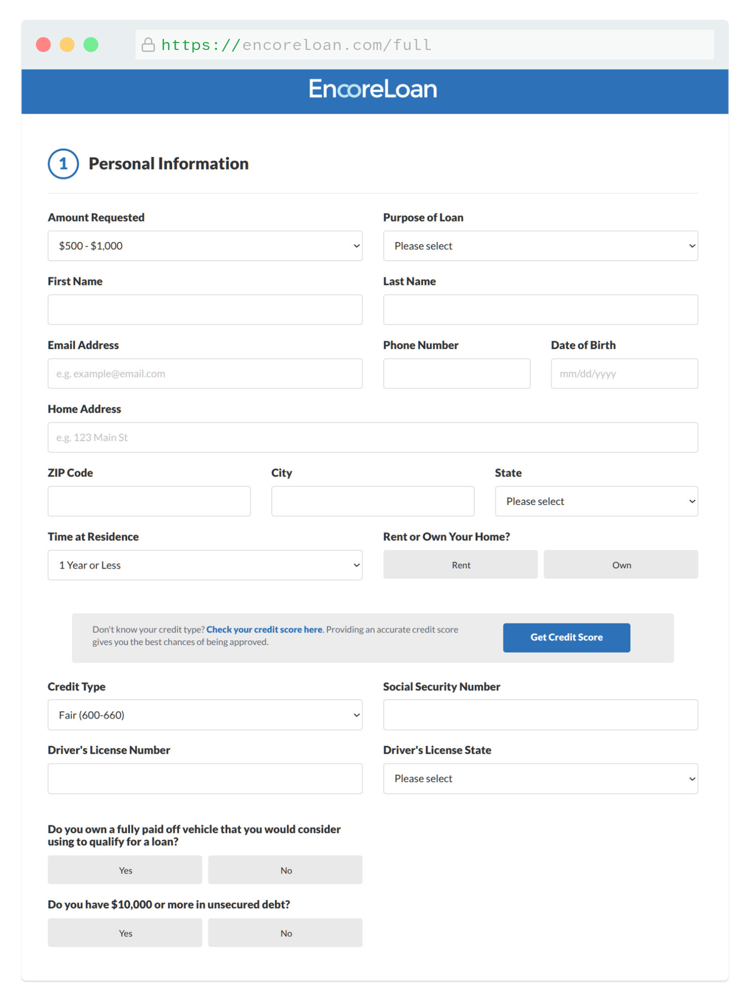

## Project Overview
Encore Loan is a fast, high-converting lead generation platform built to connect individuals with personal loan options. While financial sites can often feel cold or intimidating, the goal for Encore was to wrap a high-performance customer acquisition funnel in a warm, welcoming, and incredibly friendly user experience.

- <b>My Role</b>: Branding, UI/UX Design, Front-End Development
- <b>The Stack</b>: PHP, HTML, CSS, Vanilla JavaScript

### The Challenge
Looking for a personal loan can be a stressful experience, and users are often wary of pushy financial traps or clinical, robotic forms. To maximize qualified leads, the platform had to immediately establish a reassuring, neighborly credibility. The design and technical challenge was creating an interface that felt completely non-threatening and supportive, while maintaining a razor-sharp focus on guiding users smoothly down the page and into the data-collection process.

### The Approach & UX Solution
To lower the barrier to entry, I pivoted away from typical rigid financial layouts and designed a highly accessible, comforting user journey.

- <b>A Friendly Brand Identity:</b> I started from scratch by designing a custom logo and a cohesive visual language centered around bright, punchy colors and friendly photography. The design deliberately emphasizes human connection to put users at ease the moment the page loads.
- <b>Empathetic Content Mapping:</b> Instead of demanding immediate application details, the layout funnels users down the page using progressive blocks of content. By answering common security and timeline questions upfront, the page builds genuine trust.
- <b>Stress-Free Application Design:</b> The entire page naturally points toward a clear, encouraging Call to Action. I designed the multi-step intake questionnaire to feel light and conversational, grouping personal and financial questions into bite-sized, digestible stages that mitigate form fatigue.

### Technical Execution
To ensure zero lag and a completely frictionless experience across all device tiers, I avoided bulky frameworks and focused on clean, optimized code.

- <b>Lightweight Modular Architecture:</b> Leveraged PHP for server-side page templating, which kept the code dry and modular while delivering instant page loads with zero client-side rendering delays.
- <b>Fluid Vanilla JS UX:</b> Wrote custom JavaScript to handle strict, real-time input validation on the personal data fields. It provides helpful feedback as users type, catching errors early to ensure high-integrity lead data without heavy external scripts.
- <b>Accessible Mobile Design:</b> Hand-crafted the HTML and CSS from the ground up with a mobile-first philosophy, ensuring the form targets and UI elements are large, accessible, and satisfying to interact with on any screen size.
