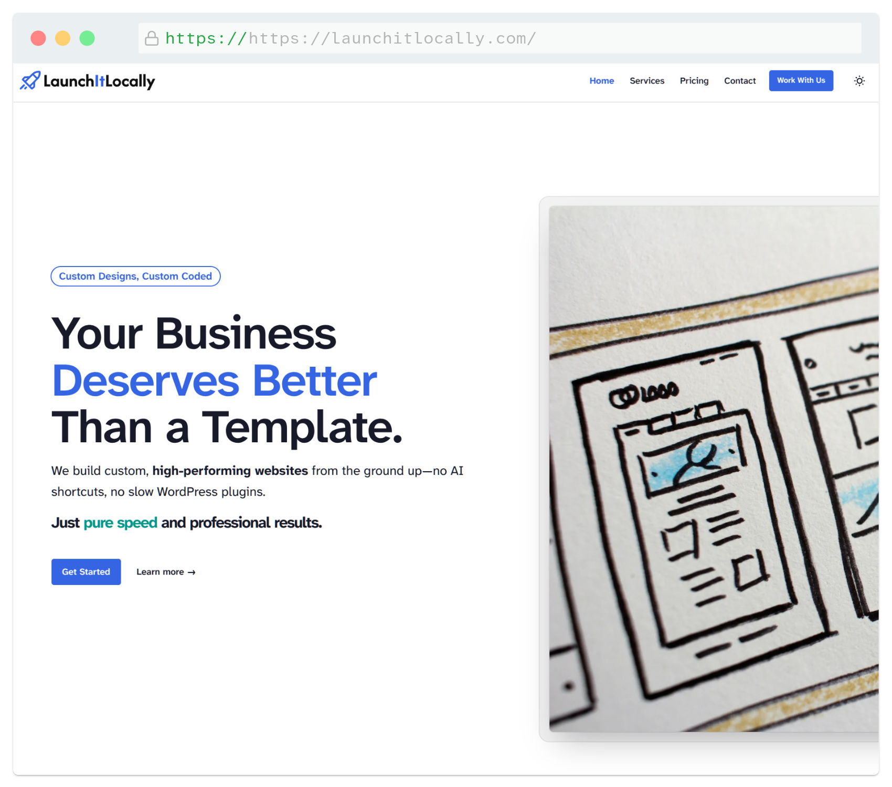
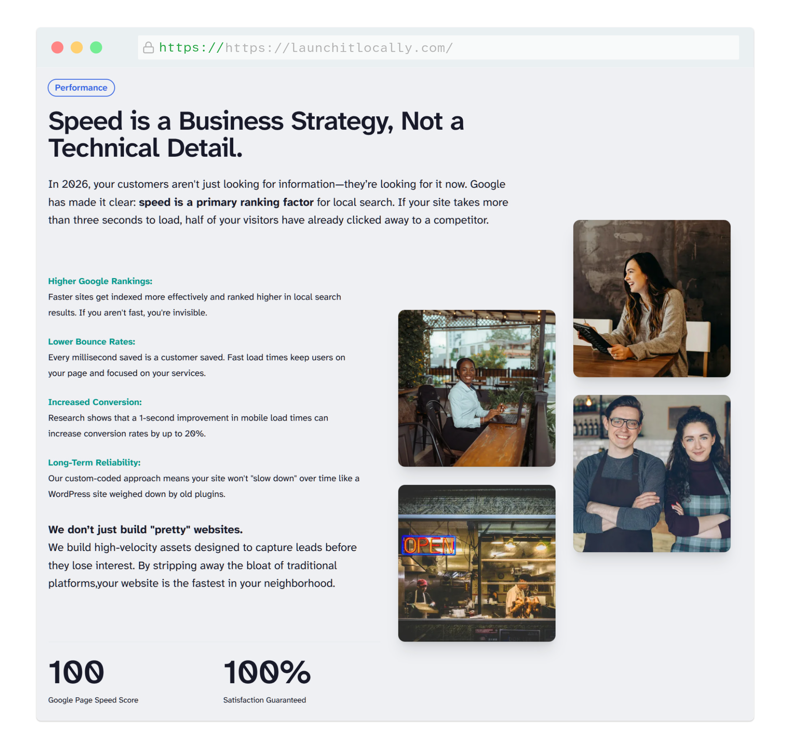

## Project Overview
Launch It Locally is a web consulting platform designed to help neighborhood small businesses establish a premium digital footprint. The goal of this site is to act as a high-performance storefront—demonstrating how modern UI/UX design, lightning-fast loading speeds, and transparent messaging can help local service companies elevate their online presence.

- <b>My Role</b>: Product Design, Front-End Development, Deployment Setup
- <b>The Stack</b>: Astro, Tailwind CSS, JavaScript

### The Challenge
Many local business owners hesitate to invest in a website because the process feels overly complex, expensive, or hidden behind agency jargon. The challenge here was to design an experience that completely flips that script. The platform needed to project institutional professionalism and neighborhood trust, while clearly demystifying the web development process for non-technical clients who just want a site that works.

### The Approach & UX Solution
To build immediate credibility, I focused on an ultra-clean layout that prioritizes upfront pricing transparency and actionable web advice over slick sales pitches.

- <b>Trust-First Visual Identity:</b> I structured the brand around a bold, authoritative blue palette and crisp layout structures. Putting a real face and name front-and-center builds instant accountability, reassuring local clients that they are working with a dedicated partner.
- <b>Clear Service Architecture:</b> I completely dropped corporate buzzwords. Instead, the page breaks down key deliverables—like responsive layouts, local search optimization, and hosting—into digestible milestones so potential clients see exactly what they get.
- <b>Frictionless Inquiry Flow:</b> The interface naturally leads users toward a low-stress contact section. The submission flow is optimized to capture project ideas without forcing users through intimidating multi-step questionnaires, maximizing consulting inquiries.

### Technical Execution
To showcase the exact kind of premium web performance being offered to clients, the platform was engineered using a cutting-edge static architecture.

- <b>Zero-JS Baseline with Astro:</b> Built the site using **Astro**, allowing me to utilize a component-based development workflow while outputting pure, lightweight HTML to the client by default. This ensures near-instant initial load times even on slow mobile connections.
- <b>Rapid UI Styling with Tailwind:</b> Used **Tailwind CSS** to author the modern layout, typography scale, and responsive grids. This utility-first approach kept the production CSS bundle exceptionally small and ensured fluid scalability across mobile, tablet, and desktop viewports.
- <b>Optimized Form Interactivity:</b> Implemented minimal, native JavaScript to handle the client-side interaction and form submission pipeline. This guarantees zero hydration delay and a completely snappy, responsive entry point for incoming business leads.
