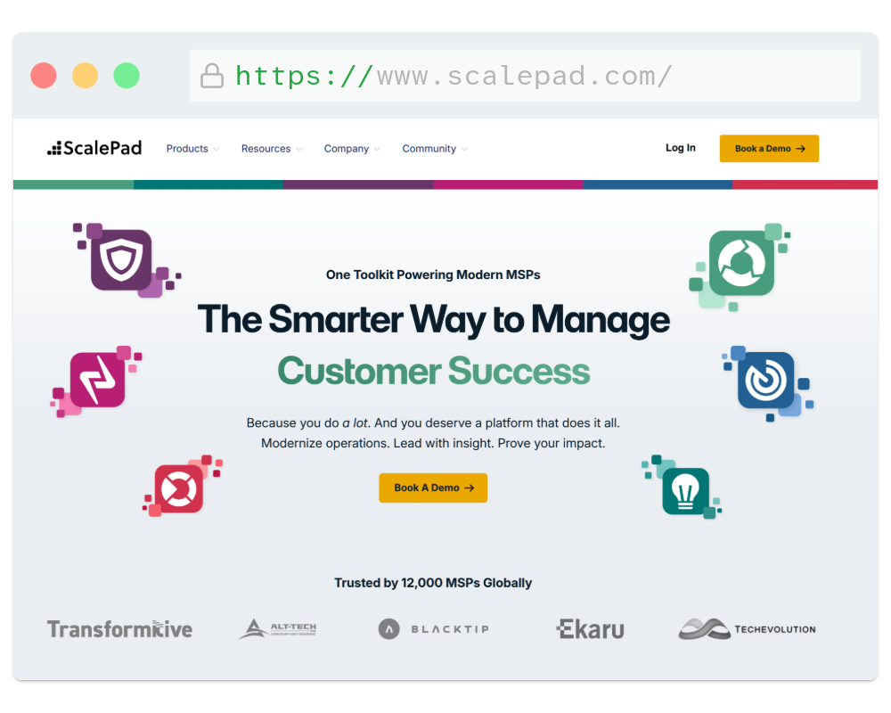
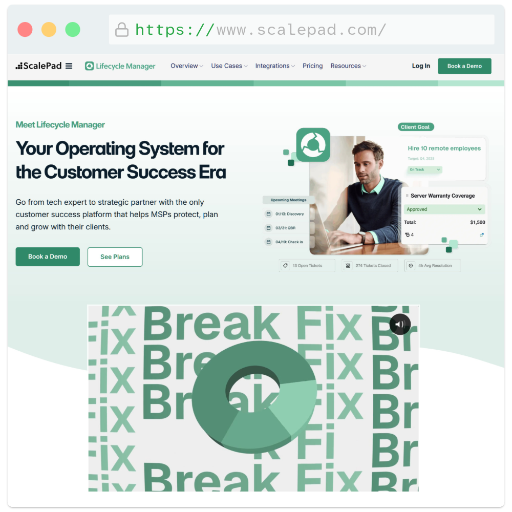

## Project Overview
ScalePad is a fast-growing SaaS company that needed to scale its marketing site into a high-performance, conversion-oriented platform. I led the front-end transition away from an unmaintainable Webflow setup into a highly structured, custom WordPress ecosystem on WPEngine. The mission was threefold: execute a comprehensive corporate rebrand, engineer a flexible publishing system for content authors, and aggressively optimize conversion paths to accelerate inbound SaaS demo signups.

- **My Role**: Front End Developer (UI Execution, Template Architecture, Analytics Integration)
- **The Stack**: WordPress, PHP, Oxygen Builder, Tailwind CSS, WPEngine

### The Challenge
As ScalePad scaled into a multi-product SaaS ecosystem tailored for Managed Service Providers (MSPs), its legacy Webflow platform hit a critical ceiling. The marketing team was completely locked out of autonomous publishing, transforming the development queue into an operational bottleneck where even simple blog posts required manual developer intervention. Furthermore, the platform lacked the deep structural flexibility and plugin ecosystem necessary to support sophisticated marketing logic, advanced tracking frameworks, and dynamic layouts. 

The technical challenge was compounded by a high-stakes corporate rebrand. Because ScalePad offers multiple distinct software products, the new web architecture had to grant each product its own unique visual identity and landing experience, while strictly adhering to a unified, overarching corporate style guide. Executing this complex design system across seven high-traffic marketing surfaces under aggressive, non-negotiable deadlines required an architecture that was simultaneously rigid in its global brand rules but highly flexible in its modular layout options.

### The Approach & UX Solution
To eliminate the content bottleneck and execute the multi-product rebrand smoothly, I engineered a highly structured, template-driven workflow that decoupled content creation from layout design.

- **Bulletproof Content Operations:** I established distinct WordPress Custom Post Types (CPTs) for Blogs, Product Updates, and News. Each CPT was bound to a locked-down, specialized template built within Oxygen. This allowed content writers to focus entirely on writing in a familiar environment without risk of breaking global layouts. For specialized layout requirements, I engineered custom, reusable modules featuring strict parameter controls—giving authors the flexibility to modify copy and select from predetermined brand colors while keeping the presentation layer completely on-brand.
- **Unified Design System & Global Variables:** To manage the aesthetic complexity of a multi-product SaaS suite, I mapped the design team's official color palettes and typographic scales directly into Oxygen’s global settings. This formed a centralized source of truth that guaranteed visual consistency across every product page. 
- **Rapid Hybrid Styling with Tailwind:** For bespoke marketing layouts and unique component demands, I heavily leveraged **Tailwind CSS**. Integrating Tailwind allowed me to rapidly assemble highly polished, modern front-end elements using utility classes, ensuring that layout grids, component spacing, and micro-interactions remained strictly uniform across all seven saved legacy pages.

### Technical Execution
To support ScalePad’s high-traffic marketing demands, the engineering focus was placed heavily on performance optimization, scalable tracking architecture, and robust platform security.

- **Aggressive Performance Optimization:** Transitioning away from legacy platforms required meeting strict Core Web Vitals benchmarks. By migrating the architecture to **WPEngine** and configuring its enterprise Speed Boost tools, I achieved a **20% increase in Google PageSpeed Insights** scores. This pipeline was optimized to handle automated HTML/CSS minification, image transcoding into modern `.webp` formats, and seamless static asset delivery via a global Content Delivery Network (CDN).
- **Scalable Tracking Architecture via GTM:** As the core point of contact for marketing analytics, I initially managed script injections directly inside global PHP header templates. To scale efficiently, I migrated the entire tracking infrastructure over to **Google Tag Manager (GTM)**. This centralized tracking layer completely decoupled analytics from the core codebase. It allowed the performance marketing team to safely deploy, edit, and audit tracking tags (such as HubSpot or Google Analytics) autonomously, removing the developer bottleneck and eliminating the need to grant non-technical staff administrative WordPress access.
- **Enterprise-Grade Platform Hardening:** Given the visibility of a multi-product SaaS brand, securing the WordPress core was paramount. I systematically locked down the authentication layer by obfuscating the default `/wp-admin` entry point to a custom, non-standard URL to mitigate brute-force automated attacks. Furthermore, I enforced strict, platform-wide multi-factor authentication, requiring mandatory **2FA configuration** for all user roles prior to dashboard access.

### Key Implementations & Web Archives

During my tenure, I engineered, maintained, and optimized key pillars of ScalePad's digital marketing ecosystem. Explore the live static archives below to view the front-end layouts and design systems in action:

- **The Homepage:** The central, high-conversion entry point optimized for multi-product positioning and brand authority. <a href="/archive/sp/home/index.html" target="_blank" rel="noopener noreferrer">Explore Live Archive</a>
- **Lifecycle Manager:** The primary marketing hub for ScalePad's flagship "Lifecycle Manager" software, engineered to highlight feature benefits and capture qualified free demo form submissions. <a href="/archive/sp/lm/index.html" target="_blank" rel="noopener noreferrer">Explore Live Archive</a>
- **SaaS Landing Page:** A highly targeted, ad-driven landing experience tailored for MSPs to showcase deep visibility tools into client software usage, risk management, and wasted spend. <a href="/archive/sp/saas/index.html" target="_blank" rel="noopener noreferrer">Explore Live Archive</a>
- **Webinar Signup:** A highly streamlined, action-oriented conversion funnel designed to guide visitors into ScalePad's active Discord channel for live technical exploration sessions. <a href="/archive/sp/discord/index.html" target="_blank" rel="noopener noreferrer">Explore Live Archive</a>
- **Industry Events:** A dynamic, centralized event directory and calendar interface displaying ScalePad's corporate web events alongside upcoming physical industry tradeshows. <a href="/archive/sp/events/index.html" target="_blank" rel="noopener noreferrer">Explore Live Archive</a>
- **Ignition:** The digital presentation surface built for ScalePad's annual flagship recorded broadcast, designed to unveil major software updates, upcoming products, and new features. <a href="/archive/sp/ignition/index.html" target="_blank" rel="noopener noreferrer">Explore Live Archive</a>
