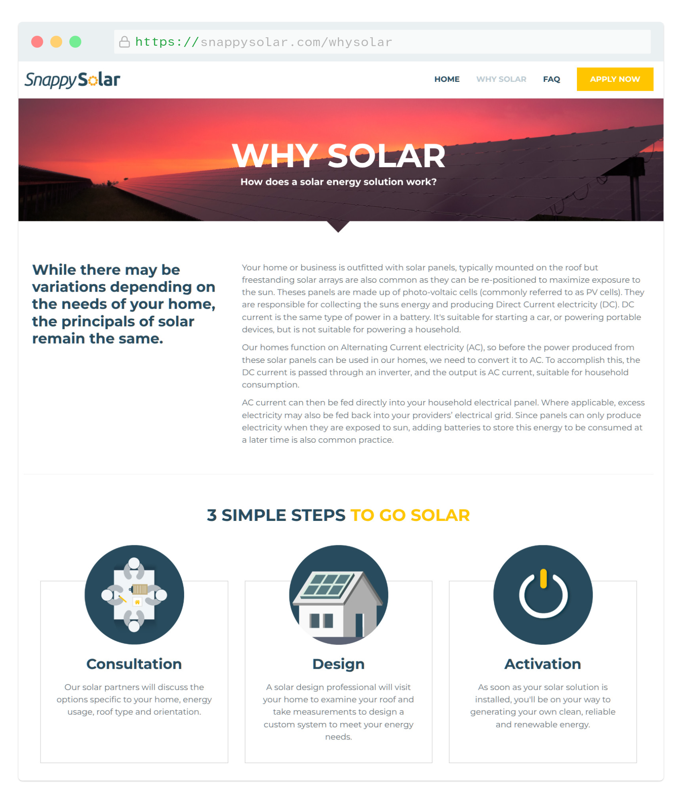
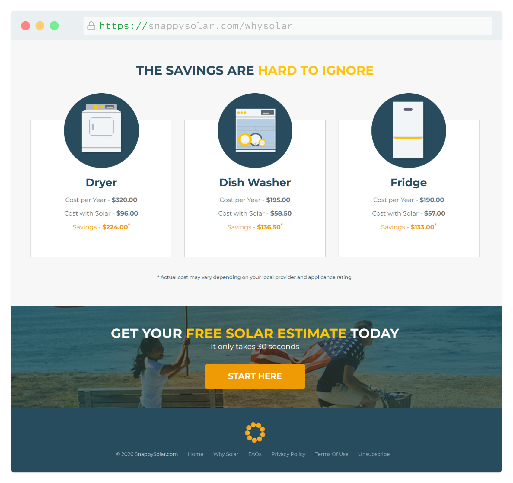

## Project Overview
Snappy Solar is a sleek, high-converting lead generation platform built to capture high-quality leads from US homeowners qualifying for solar energy systems. The project objective was to transform a data-heavy qualification process into a fast, engaging, and modern interface that educates users on savings while driving high-integrity conversions.

- <b>My Role</b>: Branding, UI/UX Design, Front-End Development
- <b>The Stack</b>: PHP, HTML, CSS, Vanilla JavaScript

### The Challenge
Solar energy qualification requires gathering precise homeowner details, including utility providers, regional location, and roof suitability. Long, complex forms usually trigger high drop-off rates. The challenge was to engineer an intuitive interface that qualifies leads strictly for high-quality utility matchmaking, without making the multi-step questionnaire feel like a daunting chore.

### The Approach & UX Solution
To capture high-intent leads, I focused the design on clean aesthetics and an interactive, value-driven questionnaire that positions solar as an accessible, cost-saving upgrade.

- <b>Eco-Modern Branding:</b> I established a distinct visual identity with a custom logo and a deep, sustainable color scheme. The interface pairs crisp layouts with modern iconography to project institutional trust and clean energy innovation.
- <b>Interactive Qualification Funnel:</b> Rather than overwhelming users with text, the site leverages structured informational milestones that visually demonstrate the long-term ROI of switching to solar power before prompting for contact info.
- <b>High-Completion Form UX:</b> I broke down the qualification parameters into small, logical steps. By using clear selection targets and simple inputs, the intake system reduces cognitive load, guiding users smoothly to the final conversion point.

### Technical Execution
Because maximizing lead volume relies heavily on fast performance across varying mobile connection speeds, I utilized a rock-solid, lightweight front-end stack.

- <b>PHP-Backed Architecture:</b> Employed PHP for modular server-side page templating. This kept the layout engine extremely dry and maintainable while ensuring the absolute fastest initial page loads with zero hydration lag.
- <b>Vanilla JS Strict Validation:</b> Engineered custom JavaScript to handle real-time qualification logic and input validation. This ensures that only well-formatted, actionable lead data is submitted, significantly protecting downstream data integrity without adding bloated framework dependencies.
- <b>Mobile-First Layouts:</b> Developed semantic HTML and custom CSS to optimize touch targets and form responsive flows. The multi-step questionnaire operates flawlessly across all modern mobile browsers and desktop displays alike.
